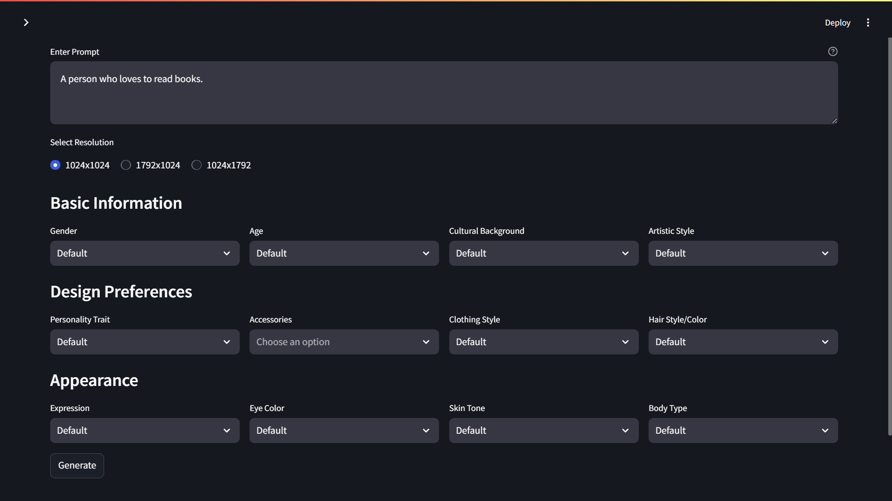

## Avatar Generator Documentation

This Python script utilizes the Streamlit library to create an interactive web application for generating avatars using OpenAI's DALL-E 3 model.



### Features

* **User-friendly Interface:** Provides a simple form for users to input their desired avatar characteristics.
* **Customizable Options:** Offers various options for gender, age, cultural background, artistic style, and more.
* **Image Generation:** Sends a detailed prompt to the DALL-E 3 API based on user input and displays the generated avatar.
* **Image Download:** Allows users to download the generated avatar to their local machine.

### Running the Application Locally

**Prerequisites:**

1. **Python:** Ensure you have Python 3.7 or higher installed on your system.
2. **Required Packages:** Install the necessary Python packages by running the following command:
   ```bash
   pip install streamlit openai requests Pillow
   ```
3. **OpenAI API Key:** Obtain an API key from OpenAI ([https://platform.openai.com/account/api-keys](https://platform.openai.com/account/api-keys)).
4. **config.json:** Create a `config.json` file in the same directory as the script. This file will contain the options for various input fields. You can structure it like this:

   ```json
   {
     "genders": ["Default", "Male", "Female", "Non-binary"],
     "ages": ["Default", "Young Adult", "Middle-Aged", "Elderly"],
     "cultural_backgrounds": ["Default", "African", "Asian", "European", "North American", "South American"],
     "artistic_styles": ["Default", "Realistic", "Cartoon", "Anime", "Abstract"],
     "personality_traits": ["Default", "Friendly", "Serious", "Creative", "Adventurous"],
     "accessories": ["Glasses", "Hat", "Earrings", "Necklace"],
     "clothing_styles": ["Default", "Casual", "Formal", "Sporty", "Bohemian"],
     "hair_styles_colors": ["Default", "Short Hair", "Long Hair", "Curly Hair", "Blonde", "Brown", "Black"],
     "expressions": ["Default", "Smiling", "Neutral", "Sad", "Angry"],
     "eye_colors": ["Default", "Brown", "Blue", "Green", "Hazel"],
     "skin_tones": ["Default", "Light", "Medium", "Dark"],
     "body_types": ["Default", "Slim", "Athletic", "Muscular", "Curvy"]
   }
   ```

**Steps:**
1. **Run the Application:** Open your terminal or command prompt, navigate to the directory containing the script, and execute the following command:
   ```bash
   streamlit run app.py
   ```
3. **Access the Application:** The application will open in your default web browser. You will be prompted to enter your OpenAI API key in the sidebar.
4. **Generate Avatars:** Fill out the form with your desired avatar characteristics and click the "Generate" button. The generated avatar will be displayed below the form.
5. **Download Avatar:** Click the "Save Image" button to download the generated avatar to your local machine.

### Code Explanation

**1. Loading Configuration (`load_config`)**

* Loads configuration details (like options for gender, age, etc.) from a `config.json` file.
* Handles potential errors like file not found and invalid JSON format.

**2. Handling Directories (`ensure_images_folder_exists`)**

* Creates an "images" folder if it doesn't exist to store the generated avatars.

**3. Finding Default Options (`find_default_index`)**

* Helper function to find the index of the "Default" option in the provided list of options.
* Used to pre-select "Default" in the UI elements.

**4. Selectbox with Default (`selectbox_with_default`)**

* Creates a Streamlit selectbox with the "Default" option pre-selected if available.

**5. User Input Collection (`get_user_input`)**

* Uses Streamlit elements like `text_area`, `radio`, `selectbox`, and `multiselect` to collect user input for various avatar attributes.
* Organizes input fields into sections using `st.subheader`.

**6. Avatar Generation (`generate_avatar`)**

* Constructs a detailed prompt string incorporating all user-selected attributes.
* Sends an API request to OpenAI's DALL-E 3 model with the generated prompt.
* Displays the generated image, revised prompt from the API, and provides a download button.
* Saves the generated image to the "images" folder.

**7. Main Application Flow (`main`)**

* Sets up the Streamlit sidebar to collect the OpenAI API key.
* Loads configuration data and initializes the OpenAI client.
* Calls `get_user_input` to display the input form and collect user choices.
* Triggers `generate_avatar` when the "Generate" button is clicked.

### Vulnerabilities

1. **API Key Exposure:** Storing the API key directly in the code or transmitting it insecurely is a security risk. Consider using environment variables or a secrets management solution.
2. **Unrestricted File Uploads:** If this application were to allow users to upload files, it would be crucial to implement robust validation and sanitization to prevent malicious uploads.
3. **Rate Limiting:** Be mindful of OpenAI's API usage limits and implement appropriate error handling and rate limiting mechanisms.
4. **Prompt Injection:** While this application doesn't directly allow user-provided prompts, any dynamic construction of prompts based on user input should be carefully validated to prevent malicious injection attacks.
